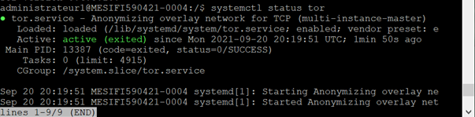

# Running a Bitcoin node

Building a Bitcoin/Lightening Node on a VM.
- Security :  Setting up SSH login, Enabling the UFW, install fail2ban
- Privacy : Configuration of Tor to run anonymously the node
- Bitcoin : Installing Bitcoind and turning it into a service
- Lightning : Lightning Network Daemon by Lightning Labs


## Tech stack
- Ubuntu 18.04.6 LTS
- Architecture AMD64
- Bitcoind 22.O
- Lnd 0.13.1-beta
- TOR 0.4.5.10

## Prerequisites
1) Update the Software 

```bash
sudo apt update
sudo apt full-upgrade
```
2) Users

Create a 'bitcoin' user, who does not have admin rights and where the bitcoin and lightning daemon will run
```bash
sudo adduser bitcoin
```
Add admin to the 'bitcoin' group with read-only privileges
```bash
sudo adduser admin bitcoin
```
```bash
sudo reboot
```
3) Create a bitcoin directory

The owner will be 'bitcoin'
```bash
sudo chown -R bitcoin:bitcoin /mnt/ext/
```
Create the directory
```bash
sudo su - bitcoin
cd /mnt/ext
mkdir bitcoin
ls -la
```
Quit the 'bitcoin' session
```bash
exit
```
## Security

The node need to be secure against attacks (because the VM will be visible from the outside) , we will secure the login with SSH key and disable the password. Then we will enable the Uncomplicated Firewall to control who is pirmitted (SSH and Electrum) . To prevent an attacker to try different password , we will use fail2ban (after five failed login attempts the service close acces for 10 minutes).

1) Log to the VM with Putty 
> [PuTTY](https://www.chiark.greenend.org.uk/~sgtatham/putty/latest.html) is an SSH and telnet client , download it and conect to the VM host with your credentials (host name,username and password)


<p align="center">  </p>

2) Login with SSH keys:
>  [Follow this guide](https://www.tecmint.com/ssh-passwordless-login-with-putty/) to generate SSH keys with PUTTY and login remotly to the server without passwords.

Generate the keys (public and private) and save them to a secure location.
Keep the public key in a text filed and paste it into the `.ssh/authorized_keys` file , we can add to this file all the public key authorized to acces to our server.
Save a session to automatically connect and login to the server with our orivate key.

<p align="center">  </p>

3) Disable the password

`!Make sure that you can connect with your SSH keys before!`
```bash
sudo nano /etc/ssh/sshd_config
```
We need to edit the SSH configuration and setting “ChallengeResponseAuthentication” and “PasswordAuthentication” to “no”, save it and restarting the SSH daemon and exit.
```sh
sudo systemctl restart sshd
exit
```

4) Enabling the UFW

```sh
sudo apt install ufw
sudo su
ufw default deny incoming
ufw default allow outgoing
ufw allow 22    comment 'allow SSH'
ufw allow 50002 comment 'allow Electrum SSL'
ufw enable
systemctl enable ufw
ufw status
```

5) Fail2ban

```sh
sudo apt install fail2ban
```
## Privacy

> We will use [Tor](https://www.torproject.org/) ( “The Onion Router”) to run anonymously the node

As Admin add the torproject repository to `sources.list`
```sh
sudo nano /etc/apt/sources.list
```

Verify the integrety of the Tor files
```sh
sudo apt install dirmngr apt-transport-https
curl https://deb.torproject.org/torproject.org/A3C4F0F979CAA22CDBA8F512EE8CBC9E886DDD89.asc | gpg --import
gpg --export A3C4F0F979CAA22CDBA8F512EE8CBC9E886DDD89 | sudo apt-key add -
```
Install Tor
```sh
sudo apt update
sudo apt install tor
```
Check if “bitcoin” belongs to the “debian-tor” group
```sh
sudo adduser bitcoin debian-tor
cat /etc/group | grep debian-to
```
Modify Tor configuration
```sh
sudo nano /etc/tor/torrc
```
```sh
# uncomment:
ControlPort 9051
CookieAuthentication 1

# add:
CookieAuthFileGroupReadable 1
```
Restart Tor
```sh
sudo systemctl restart tor
```
<p align="center">  </p>

## Bitcoin Core

1) Installation of bitcoind

With Admin 
```sh
cd /tmp
```
[Download](https://bitcoincore.org/en/download) the latest update and check the integrity
```sh
# download Bitcoin Core binary
wget https://bitcoincore.org/bin/bitcoin-core-22.0/bitcoin-22.0.tar.gz 
wget https://bitcoincore.org/bin/bitcoin-core-0.22.0/SHA256SUMS.asc
wget https://bitcoin.org/laanwj-releases.asc
```
Extract abd install Bitcoin Core
```sh
tar -xvf bitcoin-core-22.0/bitcoin-22.0.tar.gz
sudo install -m 0755 -o root -g root -t /usr/local/bin bitcoin-0.22.0/bin/*
```

2) Configuration of Bitcoind 

Bitcoin daemon will run in the background , we want it in testnet mode.
First we create a symbolic link : 
```sh
sudo su - bitcoin
ln -s /mnt/ext/bitcoin /home/bitcoin/.bitcoin
```
We configure bitcoind in `bitcoin.conf`:
```sh
nano /mnt/ext/bitcoin/bitcoin.conf
```
```sh
# /mnt/ext/bitcoin/bitcoin.conf

# Bitcoin daemon
server=1
txindex=1
testnet=1

# Network
listen=1
listenonion=1
proxy=127.0.0.1:9050
bind=127.0.0.1

# Connections
rpcuser=to_replace
rpcpassword=to_replace
zmqpubrawblock=tcp://127.0.0.1:28332
zmqpubrawtx=tcp://127.0.0.1:28333


# Initial block download optimizations
dbcache=2000
blocksonly=1
```

Start bitcoind manually :
```sh
bitcoind
```
<p align="center">  </p>

Quit the bitcoin session :
```sh
exit
```
3) Turning Bitcoind into a service

We configure the service in `bitcoin.service`:

```sh
sudo nano /etc/systemd/system/bitcoind.service
```
```sh
# /etc/systemd/system/bitcoind.service

[Unit]
Description=Bitcoin daemon
After=network.target

[Service]

# Service execution
###################

ExecStart=/usr/local/bin/bitcoind -daemon \
				                  -testnet \
				                  -pid=/run/bitcoind/bitcoind.pid \
				                  -conf=/mnt/ext/bitcoin/bitcoin.conf \
                                  -datadir=/mnt/ext/bitcoin


# Process management
####################

Type=forking
PIDFile=/run/bitcoind/bitcoind.pid
Restart=on-failure
TimeoutSec=300
RestartSec=30


# Directory creation and permissions
####################################

# Run as bitcoin:bitcoin
User=bitcoin
Group=bitcoin

# /run/bitcoind
RuntimeDirectory=bitcoind
RuntimeDirectoryMode=0710


# Hardening measures
####################

# Provide a private /tmp and /var/tmp.
PrivateTmp=true

# Mount /usr, /boot/ and /etc read-only for the process.
ProtectSystem=full

# Deny access to /home, /root and /run/user
ProtectHome=true

# Disallow the process and all of its children to gain
# new privileges through execve().
NoNewPrivileges=true

# Use a new /dev namespace only populated with API pseudo devices
# such as /dev/null, /dev/zero and /dev/random.
PrivateDevices=true

# Deny the creation of writable and executable memory mappings.
MemoryDenyWriteExecute=true

[Install]
WantedBy=multi-user.target
```
Enable the service
```sh
 sudo systemctl enable bitcoind.service
```
We link the Bitcoin data directory in the user “admin” home
```sh
 ln -s /mnt/ext/bitcoin/ /home/admin/.bitcoin
```
To monitor you can check the bitcoind status with :
```sh
 systemctl status bitcoind.service
```

<p align="center">  </p>

```sh
 sudo tail -f /mnt/ext/bitcoin/debug.log
```
Let Bitcoin Core sync fully it can take severals hours or days. 

You can then reduce the size of the database cache, to alow LND and Electrum to run in parallel , in `bitcoin.conf` comment :
```sh
 #dbcache=2000
 #blocksonly=1
```
Restart bitcoind :
```sh
 sudo systemctl restart bitcoind
```
## Lightning

1) Installation of LND

With Admin 
```sh
cd /tmp
```
[Download](https://github.com/lightningnetwork/lnd ) the latest update and check the integrity
```sh
wget https://github.com/lightningnetwork/lnd/releases/download/v0.13.1-beta/lnd-linux-amd64-v0.13.1-beta.tar.gz 
wget https://github.com/lightningnetwork/lnd/releases/download/v0.13.1-beta/manifest-v0.13.1-beta.txt
wget https://github.com/lightningnetwork/lnd/releases/download/v0.13.1-beta/manifest-roasbeef-v0.13.1-beta.sig
wget -O roasbeef.asc https://keybase.io/roasbeef/pgp_keys.asc
```
Extract abd install LND
```sh
tar -xvf lnd-linux-amd64-v0.13.1-beta.tar.gz
sudo install -m 0755 -o root -g root -t /usr/local/bin lnd-linux-amd64-v0.13.1-beta/*
```
<p align="center">  </p>

2) Configuration of LND

We want LND to work with Bitcoin Core in.
First we create a symbolic link :
```sh
sudo su - bitcoin
```
```sh
$ mkdir /mnt/ext/lnd
$ ln -s /mnt/ext/lnd /home/bitcoin/.lnd
```
We configure LND in `lnd.conf`:
```sh
nano /mnt/ext/lnd/lnd.conf
```
```sh
# /mnt/ext/lnd/lnd.conf

[Application Options]
alias=J&PNODE
# choose from: https://www.color-hex.com/
color=#3dc9b3
debuglevel=info
maxpendingchannels=5
listen=localhost
  
# Fee settings - default LND base fee = 1000 (mSat), default LND fee rate = 1 (ppm)
bitcoin.basefee=1000
bitcoin.feerate=1
  
# Minimum channel size (in satoshis, default is 20,000 sats)
minchansize=100000
  
# Accept AMP (multi-paths) payments, wumbo channels and do not prevent the creation of anchor channel (default value)
accept-amp=true
protocol.wumbo-channels=true
protocol.no-anchors=false
  
# Save on closing fees
## The target number of blocks in which a cooperative close initiated by a remote peer should be confirmed (default: 10 blocks).
coop-close-target-confs=24

#########################
# Improve startup speed # (from https://www.lightningnode.info/advanced-tools/lnd.conf by Openoms)
#########################
# If true, we'll attempt to garbage collect canceled invoices upon start.
gc-canceled-invoices-on-startup=true
# If true, we'll delete newly canceled invoices on the fly.
gc-canceled-invoices-on-the-fly=true
# Avoid historical graph data sync
ignore-historical-gossip-filters=1
# Enable free list syncing for the default bbolt database. This will decrease
# start up time, but can result in performance degradation for very large
# databases, and also result in higher memory usage. If "free list corruption"
# is detected, then this flag may resolve things.
sync-freelist=true
# Avoid high startup overhead
# If true, will apply a randomized staggering between 0s and 30s when
# reconnecting to persistent peers on startup. The first 10 reconnections will be
# attempted instantly, regardless of the flag's value
stagger-initial-reconnect=true

########################
# Compact the database # (slightly modified from https://www.lightningnode.info/advanced-tools/lnd.conf by Openoms)
########################
# Can be used on demand by commenting in/out the two options below: it can take several minutes
[bolt]
# Whether the databases used within lnd should automatically be compacted on
# every startup (and if the database has the configured minimum age). This is
# disabled by default because it requires additional disk space to be available
# during the compaction that is freed afterwards. In general compaction leads to
# smaller database files.
db.bolt.auto-compact=true
# How long ago the last compaction of a database file must be for it to be
# considered for auto compaction again. Can be set to 0 to compact on every
# startup. (default: 168h; the time unit must be present, i.e. s, m or h, except for 0)
db.bolt.auto-compact-min-age=168h

[Bitcoin]
bitcoin.active=1
bitcoin.testnet=1
#bitcoin.mainnet=1
bitcoin.node=bitcoind

[tor]
tor.active=true
tor.v3=true
tor.streamisolation=true
```

Start LND manually :
```sh
lnd
```

Quit the bitcoin session :
```sh
exit
```
3) Turning LND into a service

We configure the service in `lnd.service`:

```sh
sudo nano /etc/systemd/system/lnd.service
```
```sh
# /mnt/ext/lnd/lnd.conf

[Application Options]
alias=J&PNODE
# choose from: https://www.color-hex.com/
color=#3dc9b3
debuglevel=info
maxpendingchannels=5
listen=localhost
  
# Fee settings - default LND base fee = 1000 (mSat), default LND fee rate = 1 (ppm)
bitcoin.basefee=1000
bitcoin.feerate=1
  
# Minimum channel size (in satoshis, default is 20,000 sats)
minchansize=100000
  
# Accept AMP (multi-paths) payments, wumbo channels and do not prevent the creation of anchor channel (default value)
accept-amp=true
protocol.wumbo-channels=true
protocol.no-anchors=false
  
# Save on closing fees
## The target number of blocks in which a cooperative close initiated by a remote peer should be confirmed (default: 10 blocks).
coop-close-target-confs=24

#########################
# Improve startup speed # (from https://www.lightningnode.info/advanced-tools/lnd.conf by Openoms)
#########################
# If true, we'll attempt to garbage collect canceled invoices upon start.
gc-canceled-invoices-on-startup=true
# If true, we'll delete newly canceled invoices on the fly.
gc-canceled-invoices-on-the-fly=true
# Avoid historical graph data sync
ignore-historical-gossip-filters=1
# Enable free list syncing for the default bbolt database. This will decrease
# start up time, but can result in performance degradation for very large
# databases, and also result in higher memory usage. If "free list corruption"
# is detected, then this flag may resolve things.
sync-freelist=true
# Avoid high startup overhead
# If true, will apply a randomized staggering between 0s and 30s when
# reconnecting to persistent peers on startup. The first 10 reconnections will be
# attempted instantly, regardless of the flag's value
stagger-initial-reconnect=true

########################
# Compact the database # (slightly modified from https://www.lightningnode.info/advanced-tools/lnd.conf by Openoms)
########################
# Can be used on demand by commenting in/out the two options below: it can take several minutes
[bolt]
# Whether the databases used within lnd should automatically be compacted on
# every startup (and if the database has the configured minimum age). This is
# disabled by default because it requires additional disk space to be available
# during the compaction that is freed afterwards. In general compaction leads to
# smaller database files.
db.bolt.auto-compact=true
# How long ago the last compaction of a database file must be for it to be
# considered for auto compaction again. Can be set to 0 to compact on every
# startup. (default: 168h; the time unit must be present, i.e. s, m or h, except for 0)
db.bolt.auto-compact-min-age=168h

[Bitcoin]
bitcoin.active=1
bitcoin.testnet=1
#bitcoin.mainnet=1
bitcoin.node=bitcoind

[tor]
tor.active=true
tor.v3=true
tor.streamisolation=true
```

# More

- Turning LND into a service 
- Creating a wallet and depositing tBTC in it 
- Opening a lightning channel 
- Running your own BTC explore

> For more see the following [guide](https://stadicus.github.io/RaspiBolt/)
